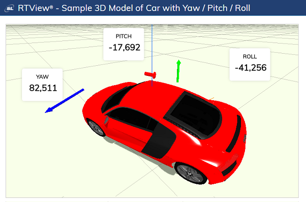

# RTView-3D

This repository provides information and examples that show how to render and implement data-driven animation of 3D graphical models within RTView displays.   

**RTView** is a real-time data management, visualization and analytics engine provided by SL Corporation (www.sl.com). It is used by organizations worldwide as a key component of mission-critical monitoring and control systems built around various middleware, infrastructure, telemetry and IoT data sources.

In such applications, it is often most effective to present real-time dynamic data in a 3-dimensional representation. For example, a satellite telemetry feed containing information about the orientation of its solar panels might best be visualized using a 3D rendering of the solar panels rotated in real-time as the data change. This and many other similar displays can readily be created and published to users using the tools available with RTView.



**[Three.js](https://threejs.org/)** is widely used 3D Javascript rendering library, specifically designed for use in HTML browser applcations. With it one can create and render complex dynamic 3D models, as well as import models created with tools such as AutoCAD, Blender, Maya, and others. This repository shows how to use Three.js to render models within the context of RTView and manipulate them with real-time data accessed from datasources provided by RTView.

In addition, displays containing 3D representations can be combined with other real-time displays such as charts, tables, diagrams, and more, to create complete dashboard applications for monitoring and controlling complex applications or processes.

By following the steps described below you will:

* Create an account on RTView Cloud.
* Upload a set of sample 3D model files to your RTView Cloud account.
* Create, deploy, and publish displays that drive these sample models with real-time data.
* Learn how to create your own 3D models and extend RTView in new ways.

## Create an RTView Cloud account
An RTView Cloud account provides the tools for creating, viewing and publishing rich graphical displays connected to real-time data sources.

* In a browser, go to [RTView Cloud](http://rtviewcloud.sl.com/).
* Click on Start Free Trial to create your account (skip if you have an account already).
* Login to your RTView Cloud account.

Note that you are automatically placed into your own private organization (e.g. JohnSPrivateOrg).

## Upload the sample 3D HTML snippets to RTView Cloud

* In a browser, go to [RTView Cloud](http://rtviewcloud.sl.com/).

* Upload the sample 3D models to an RTView Cloud Assets folder: 
```
On the RTView Cloud top menu bar, open the Settings menu (select the 'gear' icon).
Choose the Assets option.
Select 'Create Directory' and enter 'html' to create a folder to hold your HTML assets (skip if it exists).
Select the 'html' folder.
Choose 'Add File', navigate to the 'assets/html' folder in this github repo,
    and select one or all of the html snippets to upload.
Select 'Open' to initiate the upload process. 
```

## Import and view the sample displays in RTView Cloud

* In a browser, go to [RTView Cloud](http://rtviewcloud.sl.com/).

* Import the sample displays:
```
On the RTView Cloud top menu bar, click on Design to invoke the RTDraw visual editing tool.
Select the File dropdown menu and click on Import.
Select "as Private". 
In the file browser, navigate to the *displays* directory within this project.
Select one or more of the sample display .json files and click Open.
```
* View or edit the sample display:
```
Select the File dropdown menu and click on Open...
Double click the name of a display to open and view it in real-time.
```
This sample display is configured to reference a copy of the threejs html snippets from localhost.
Simply select the threejs instance object and in the property sheet to the right, find the 'Source' property. Paste in the URL of the threejs html snippet you uploaded to make it active. Once loaded you can experiment with the variables that are surfaced to control various aspects of the threejs model. 

You can experiment with the editing features of RTDraw to make changes to these displays or create your own.

## Achieved Goals
In this RTView JavaScript you will have achieved the following: 
* Seen how easy it is to display user data in graphical and highly configurable displays in the Cloud.
* Launched the simple node program used to create and send data to RTView.
* Seen how users are able to view or enhance a sample RTView display or create new displays.

**Feel free to experiment with, modify or enhance this project, and share your experience, comments and suggestions with us. Please fork this repo and submit a pull request for any changes you would like to suggest.**
